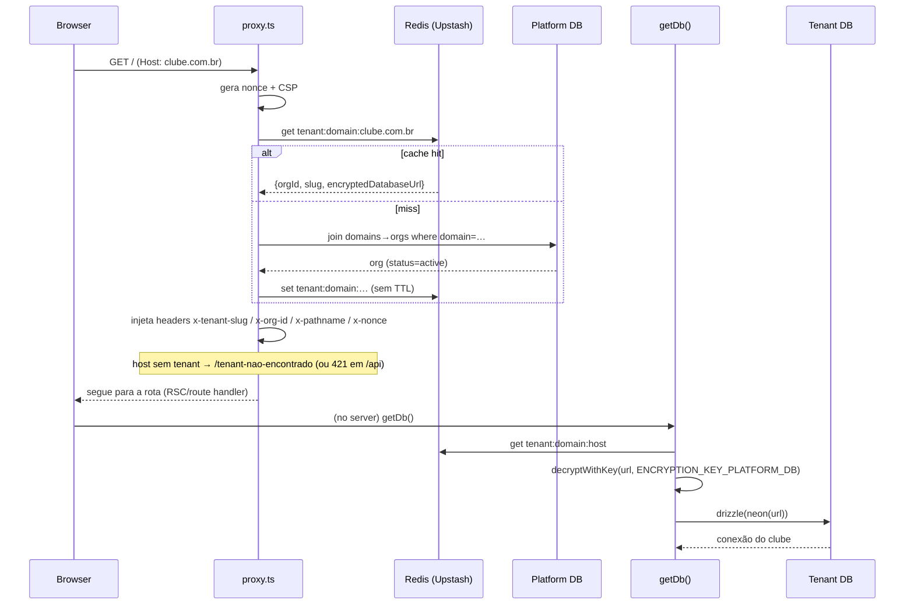

# Arquitetura Multi-Tenant (Sport55)

Documentação técnica de como a separação de tenants (clubes) foi implementada
nesta plataforma. O objetivo do design é **isolamento forte por padrão**: cada
clube tem seu próprio banco de dados, e um clube nunca consegue ler, inferir ou
escrever dados de outro — mesmo em caso de bug de aplicação.

> Público-alvo: engenharia. Referências de arquivo apontam para o código real.

---

## 1. Modelo em uma frase

**Database-per-tenant**, com um **banco de plataforma** central que só guarda o
mapa `domínio → clube → connection string (cifrada)`. A cada request, um proxy
resolve o clube pelo **host** e injeta o contexto; a camada de dados abre a
conexão do banco daquele clube. Não existe banco "padrão" em produção — host
sem clube resolvido é barrado (**fail-closed**).

```
                         ┌─────────────────────────────┐
   request (host)  ──►   │  proxy.ts (Edge, todo request)│
                         │  resolveTenant(host)          │
                         └───────────────┬──────────────┘
                                         │ x-tenant-slug / x-org-id (headers)
                                         ▼
                         ┌─────────────────────────────┐
                         │  getDb()  (por request)      │
                         │  slug → URL cifrada → Neon   │
                         └───────────────┬──────────────┘
                                         ▼
   ┌───────────────┐   ┌───────────────┐   ┌───────────────┐
   │ DB clube A    │   │ DB clube B    │   │ DB clube C    │   (Neon, 1 por clube)
   └───────────────┘   └───────────────┘   └───────────────┘

   ┌──────────────────────────────────────────────────────┐
   │ PLATFORM DB  (organizations, domains, admins, flags)  │  ← só o "mapa"
   └──────────────────────────────────────────────────────┘
```

---

## 2. Os dois planos de banco

### 2.1 Platform DB (`PLATFORM_DATABASE_URL`)

Banco único da plataforma. **Não** guarda dados de negócio dos clubes — só o
registro dos tenants e o controle global. Schema em
[`src/lib/db/platform/schema.ts`](../src/lib/db/platform/schema.ts):

| Tabela | Papel |
|---|---|
| `organizations` | 1 linha por clube: `id`, `slug`, `database_url` (**cifrada**), `status` (`active`/…), `plan`. |
| `organization_domains` | Mapa `domain → org_id`. Um clube pode ter vários domínios (apex, www, localhost em dev). PK = `domain`. |
| `platform_admins` | Admins do **sistema** (acima do tenant). Autenticam em fluxo próprio. Ver §6. |
| `platform_feature_flags` | Kill-switch **global** por feature (`enabled`, `public_too`). Ver §7. |
| `platform_feature_overrides` | Exceção por clube ao flag global (PK `org_id+key`). |

Cliente: [`getPlatformDb()`](../src/lib/db/platform/client.ts) — singleton simples
apontando para `PLATFORM_DATABASE_URL`.

### 2.2 Tenant DBs (um por clube)

Cada clube é um **banco Neon separado**, todos com o **mesmo schema de aplicação**
([`src/lib/db/schema`](../src/lib/db/schema)). As migrations de aplicação são
aplicadas **por tenant** (cada banco roda o mesmo conjunto de migrations).

A connection string de cada clube fica **cifrada** em `organizations.database_url`
e só é decifrada em runtime, no servidor, para abrir a conexão.

---

## 3. Resolução de tenant (o caminho de um request)

Ponto de entrada: [`src/proxy.ts`](../src/proxy.ts) (o "middleware" deste Next),
que roda em **todo** request pelo `matcher` no fim do arquivo.

Sequência:



### 3.1 `resolveTenant(host)` — [`src/lib/tenant.ts`](../src/lib/tenant.ts)

1. Se faltar `PLATFORM_DATABASE_URL` ou as chaves do Redis → retorna `null`
   (ambiente não multi-tenant).
2. Normaliza o host (tira a porta), monta a chave `tenant:domain:<domain>`.
3. **Redis first**: se houver cache, retorna direto.
4. **Miss**: consulta o platform DB (`organization_domains ⋈ organizations`),
   exige `status === "active"`, e grava no Redis.
   - **Sem TTL de propósito**: a URL cifrada quase nunca muda; toda mutação de
     tenant (URL, status, domínio) **deve** chamar `invalidateTenantCache(domain)`
     (o script `set-tenant-runtime-url.mjs` faz isso). Evita bater no platform DB
     a cada request.
5. Retorna `{ orgId, slug, encryptedDatabaseUrl }`. Qualquer erro → `null`
   (fail-closed).

### 3.2 Injeção de contexto — `proxy.ts`

Com o tenant resolvido, o proxy injeta nos **headers do request**:

- `x-tenant-slug` — identifica o clube para a camada de dados;
- `x-org-id` — id da organização;
- `x-pathname` — caminho (usado por `getDb` para o override de plataforma);
- `x-nonce` + `Content-Security-Policy` — CSP por request (nonce único).

### 3.3 Fail-closed

Se **não** há tenant e a rota não é isenta e não é localhost em dev:

- `/api/*` → **HTTP 421** (`Domínio não configurado`);
- demais → *rewrite* para `/tenant-nao-encontrado`.

Rotas isentas (`TENANT_AGNOSTIC_PREFIXES`): `/api/cron`, `/api/qstash` (jobs e
callbacks que usam o platform DB, não `getDb`). Em **dev**, `localhost` é servido
pelo `DATABASE_URL` local como conveniência (`isDevLocalhost`).

**Não existe banco padrão em produção.** Chegar em `getDb()` sem slug em produção
lança erro (é anômalo — o proxy já teria barrado).

---

## 4. Camada de dados: `getDb()` — [`src/lib/db/client.ts`](../src/lib/db/client.ts)

`getDb()` é embrulhado em `React.cache()` → **uma resolução por request** (dedupe
do custo de ler headers/cookies/JWT). A reutilização de conexão **entre** requests
é feita por um `Map` de módulo (`connCache`), por slug, **por instância**
serverless.

Ordem de resolução:

1. **Override do admin do sistema** (`resolvePlatformOverrideSlug`, ver §6): se um
   admin de plataforma escolheu um clube, `getDb()` aponta para o DB **daquele**
   clube. Blindado: só vale com um JWT de plataforma válido e apenas em superfícies
   `/admin` (fora de `/admin/sistema`) e `/api/admin`.
2. Lê `x-tenant-slug` do header. Sem slug:
   - dev + `DATABASE_URL` → usa o DB local;
   - produção → **lança** (não há default).
3. `connCache.has(slug)` → reusa a conexão.
4. Senão: lê o `TenantContext` do Redis (`tenant:domain:<host>`), **decifra** a
   URL com `ENCRYPTION_KEY_PLATFORM_DB`, cria `drizzle(neon(url))`, e cacheia.

Todas as queries de negócio usam `getDb()` — **nunca** o `db` default (que só
existe como conveniência de dev e lança sem `DATABASE_URL`).

---

## 5. Isolamento e defesa em profundidade

O isolamento não depende de um `WHERE tenant_id = …` correto em cada query (fonte
clássica de vazamento multi-tenant). Ele é **físico**: bancos distintos.

Camadas:

1. **Separação física** — cada clube num banco Neon próprio. Um bug de query em um
   clube não alcança outro: são conexões e bancos diferentes.
2. **Connection string cifrada em repouso** — `organizations.database_url` é
   AES-256-GCM. Decifrada só no servidor, em runtime.
   [`encryptWithKey`/`decryptWithKey`](../src/lib/payment/encryption.ts): chave de
   32 bytes (`ENCRYPTION_KEY_PLATFORM_DB`, 64 hex), formato
   `base64( iv[12] | authTag[16] | ciphertext )`.
3. **Fail-closed no proxy** — host desconhecido nunca cai no site de outro clube.
4. **Cache sempre com escopo de slug** — todo cache de leitura inclui o slug na
   chave (ver §8). Não há cache global que misture clubes.
5. **Least-privilege no banco** — o runtime conecta com o papel `app_runtime`
   (só CRUD, sem DDL/DROP). A troca da URL para esse papel é feita por
   `set-tenant-runtime-url.mjs` (re-cifra e invalida o cache).
6. **Override de plataforma assinado** — o único jeito de operar o DB de outro
   clube pelo painel `/admin` exige um JWT de escopo `platform` (§6); um admin de
   tenant não consegue forjar.

**Invariante central:** o `slug`/`orgId` vem **sempre** do header injetado pelo
proxy (derivado do host) ou de um JWT de plataforma verificado — **nunca** de
input do cliente (body, query, cookie não assinado).

---

## 6. Admin do Sistema (plano de plataforma)

Nível acima do admin de clube. Vive no platform DB (`platform_admins`), autentica
num fluxo próprio e pode **trocar de contexto** entre clubes.

- **Console:** `/admin/sistema` (login em `/admin/sistema/login`).
- **Auth:** e-mail + senha (bcrypt custo 12) →
  [`platform-auth.ts`](../src/app/actions/platform-auth.ts). Sessão em cookie
  `sport55_platform_token` (JWT `scope: "platform"`, assinado com
  `PLATFORM_JWT_SECRET`, com fallback para `ADMIN_JWT_SECRET`).
- **Guarda no proxy:** `/admin/sistema/*` exige o JWT de plataforma; escopo
  diferente de `platform` → volta pro login.

### 6.1 Override de contexto (operar um clube)

Quando um platform admin escolhe um clube, grava-se o cookie `sport55_ctx_tenant`
= slug. A partir daí:

- **proxy**: em `/admin` (não `/admin/sistema`), aceita a sessão de plataforma no
  lugar do token de tenant; se o clube não foi escolhido, redireciona ao console.
- **getDb** (`resolvePlatformOverrideSlug`): aponta a conexão para o DB do clube
  escolhido — **mas só** se `sport55_platform_token` for um JWT `platform` válido,
  e apenas em `/admin` e `/api/admin`. O cookie `sport55_ctx_tenant` sozinho é
  **inerte** (não basta para trocar de contexto). Fail-closed: qualquer falha →
  ignora o override.

Dois admins **não se confundem**: `platform_admins` (sistema, no platform DB) ≠
`adminUsers` (por-clube, dentro do DB de cada tenant).

### 6.2 Feature flags / kill-switch global

- `platform_feature_flags`: uma linha por feature; `enabled=false` esconde a
  feature de **todos** os clubes (nav + rotas + actions). `public_too=true` também
  esconde no site público. Ausência de linha = ligado (default).
- `platform_feature_overrides`: exceção por clube (sobrescreve o global para um
  `org_id`).
- Registry e resolução em [`src/lib/platform/features.ts`](../src/lib/platform/features.ts),
  com cache `unstable_cache` (TTL 30s, tag `platform-flags`).

---

## 7. Camadas de cache (e por que não vazam)

| Camada | Onde | Escopo | Invalidação |
|---|---|---|---|
| Resolução de tenant | Redis `tenant:domain:<domain>` | por domínio | explícita (`invalidateTenantCache`) |
| Conexão Drizzle | `connCache` (Map de módulo) | por slug, por instância | reciclada no redeploy/reciclagem da instância |
| Dedupe por request | `React.cache()` no `getDb` | por request | fim do request |
| Leituras de negócio | `tenantRead()` = `unstable_cache` | **chave inclui o slug**, TTL 60s, tag `tenant:<slug>` | `revalidateTag('tenant:<slug>')` nas escritas do admin |

`tenantRead(key, slug, fn)` ([`src/lib/db/queries.ts`](../src/lib/db/queries.ts))
é o helper padrão de leitura cacheada: a chave **sempre** carrega o `slug`, então
o cache de um clube nunca é servido a outro. Edições no painel chamam
`revalidateTag('tenant:<slug>')` para invalidar na hora.

---

## 8. Provisionamento e operação

Todos os scripts leem do `.env.local`, têm **dry-run** por padrão e só escrevem
com `--commit`. Migrations são aplicadas **manualmente** (o `db:migrate` trava no
ambiente; usar Neon HTTP / branch de teste).

| Script | O que faz |
|---|---|
| [`scripts/seed-platform-admin.mjs`](../scripts/seed-platform-admin.mjs) | Cria o 1º admin do sistema (`platform_admins`). Idempotente; senha ≥10 chars, bcrypt. |
| [`scripts/register-misto-tenant.mjs`](../scripts/register-misto-tenant.mjs) | Cadastra um clube: cifra a `DATABASE_URL` e insere em `organizations` + `organization_domains`. Idempotente. |
| [`scripts/set-tenant-runtime-url.mjs`](../scripts/set-tenant-runtime-url.mjs) | Troca a connection string cifrada de um clube (ex.: migrar para o papel `app_runtime`) e invalida o cache Redis dos domínios. |
| [`scripts/encrypt-db-url.ts`](../scripts/encrypt-db-url.ts) | Utilitário de cifra de uma URL avulsa. |

**Provisionar um novo clube (visão geral):**

1. Criar o banco Neon do clube e rodar as migrations de aplicação nele.
2. Criar o papel `app_runtime` (só CRUD) e obter a connection string.
3. `register-*`/`set-tenant-runtime-url.mjs` → cifra a URL e grava em
   `organizations` + mapeia os domínios em `organization_domains`.
4. Apontar o DNS do domínio para a Vercel; após mudanças, **invalidar o cache**
   (o script já tenta) e, quando trocar a URL, **redeploy** para reciclar as
   instâncias (o `connCache` é por instância).

---

## 9. Variáveis de ambiente (contexto multi-tenant)

| Var | Papel |
|---|---|
| `PLATFORM_DATABASE_URL` | Banco de plataforma (mapa de tenants, admins, flags). |
| `ENCRYPTION_KEY_PLATFORM_DB` | Chave AES-256-GCM (32 bytes/64 hex) que cifra as URLs dos bancos dos clubes. |
| `UPSTASH_REDIS_REST_URL` / `_TOKEN` | Cache de resolução de tenant (obrigatório em produção). |
| `PLATFORM_JWT_SECRET` | Assina a sessão do admin do sistema (fallback: `ADMIN_JWT_SECRET`). |
| `ADMIN_JWT_SECRET` | Assina a sessão do admin de tenant. |
| `DATABASE_URL` | **Só dev** (localhost). Em produção não há DB padrão. |
| `APP_URL` | Fallback de base URL fora de um request scope (scripts/cron). |

Em runtime, a URL base do clube é **derivada do host** (`getAppBaseUrl`) e o slug
vem do header (`getCurrentTenantSlug`) — nunca de domínio hardcoded
([`src/lib/base-url.ts`](../src/lib/base-url.ts)).

---

## 10. Checklist de invariantes (para revisão de código)

- [ ] Query de negócio usa `getDb()` (nunca o `db` default).
- [ ] `slug`/`orgId` vêm de header injetado pelo proxy ou de JWT `platform`
      verificado — **nunca** de input do cliente.
- [ ] Toda leitura cacheada usa `tenantRead(key, slug, …)` com o slug na chave.
- [ ] Escrita no admin invalida `revalidateTag('tenant:<slug>')`.
- [ ] Mutação de tenant (URL/status/domínio) invalida o cache Redis do domínio.
- [ ] Nova rota que roda sem host resolvido entra em `TENANT_AGNOSTIC_PREFIXES`
      conscientemente (e usa o platform DB, não `getDb`).
- [ ] Nada de connection string ou segredo em log, código ou bundle do cliente.

---

### Histórico

A separação foi entregue em estágios (ver histórico do repo): fundação
neutra de config → matar vazamentos de identidade hardcoded → **Estágio 1**
(tenant fail-closed) → **Estágio 2** (misto como tenant + least-privilege) →
**Admin do Sistema** (platform_admins, override, kill-switch/flags).
